## Table of Contents
1. [Database](#database)
1. [Author(s)](#author)
1. [Database description](#description)

# Database
covid19_supply

# Author(s)
1.Priyal Manish Sharma  
2.Vineeth Myneedi

# Database description
It is essential to have a software application that can help us to manage the COVID-19 supplies and ensure adequate distribution to the people in need.  
Our database system contains five entities:  
hospital: List of hospitals that make the request of supplies  
customer: List of customers that make the request of supplies  
product: List of products that can be ordered  
supplier: List of suppliers that supply the products or manage them  
delivery_staff: List of individuals who deliver the supplies  
Our database system will play a key role in capturing the snapshot of supply chain of essential covid-19 products by storing the data of various entities involved. This data can be further used in the applications to assess the availability of stock and transit time of supply during an hour of emergency. The important feature of this project is that it’s implementation is towards the goal that it only stores the data related to the covid-19 supplements. This is a small subset and hence would be faster as compared to general health supply systems. The database would act as a backend and a Java GUI published on a web server will act as the query search engine. We can have a master login for the web page for updating the database.

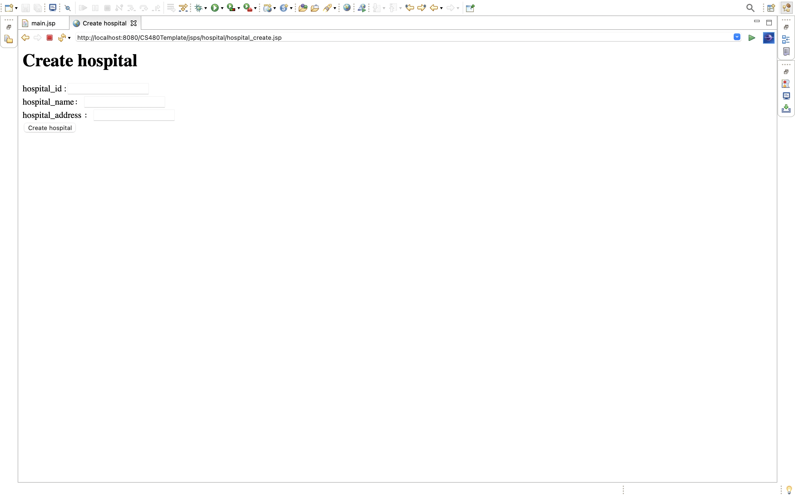
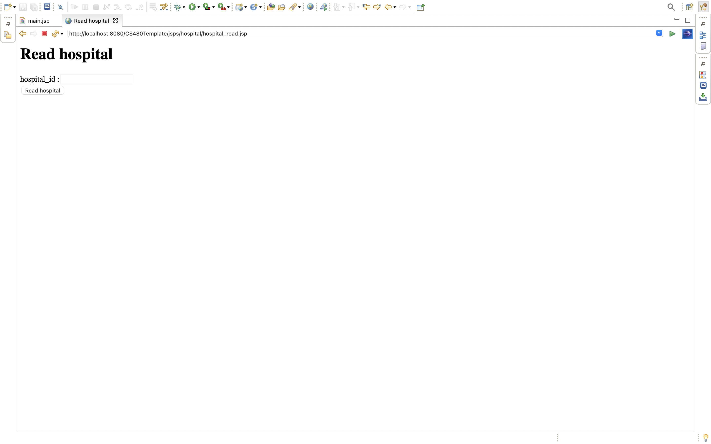

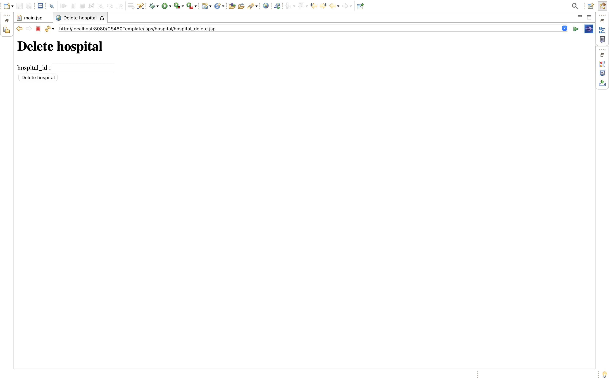

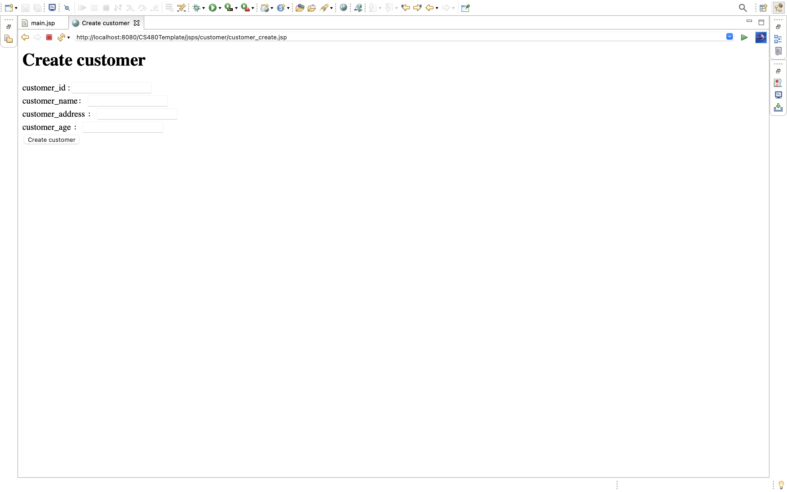

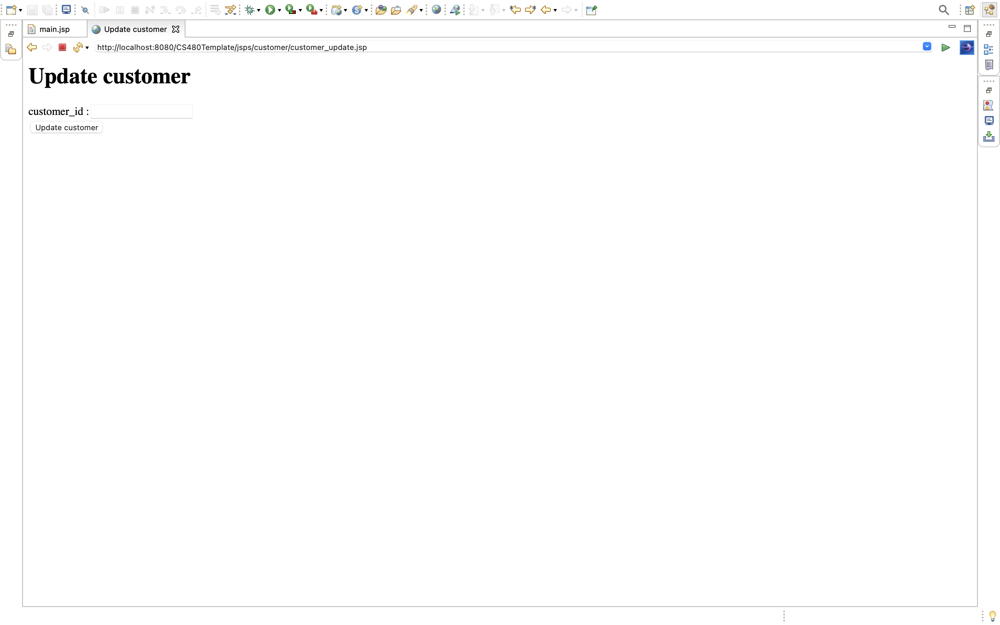

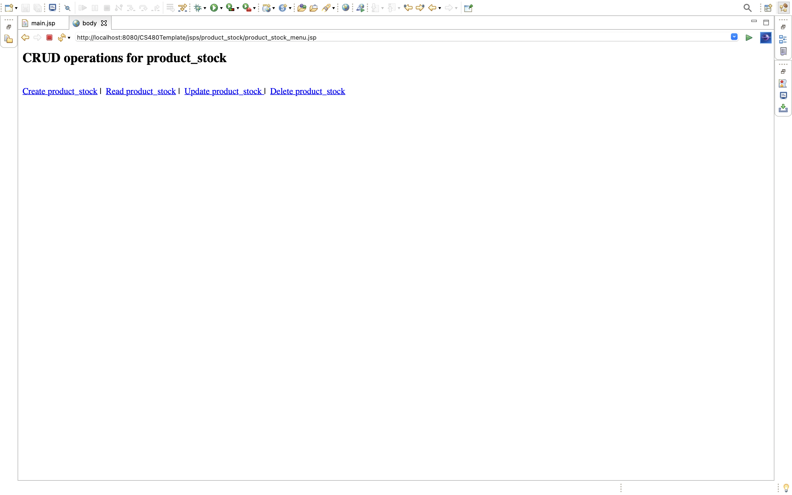
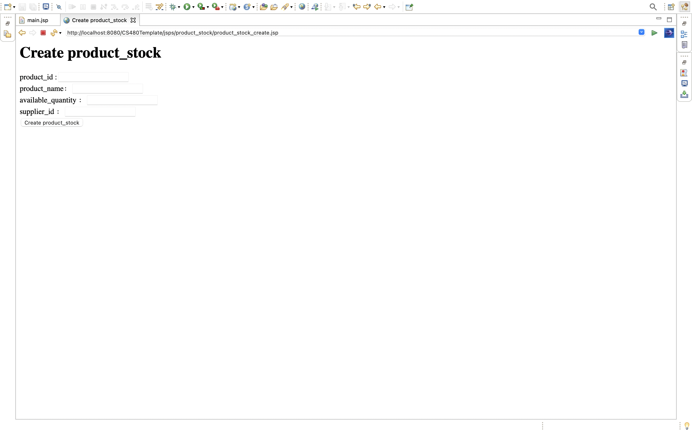

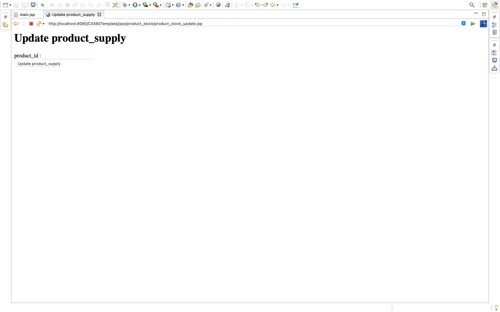
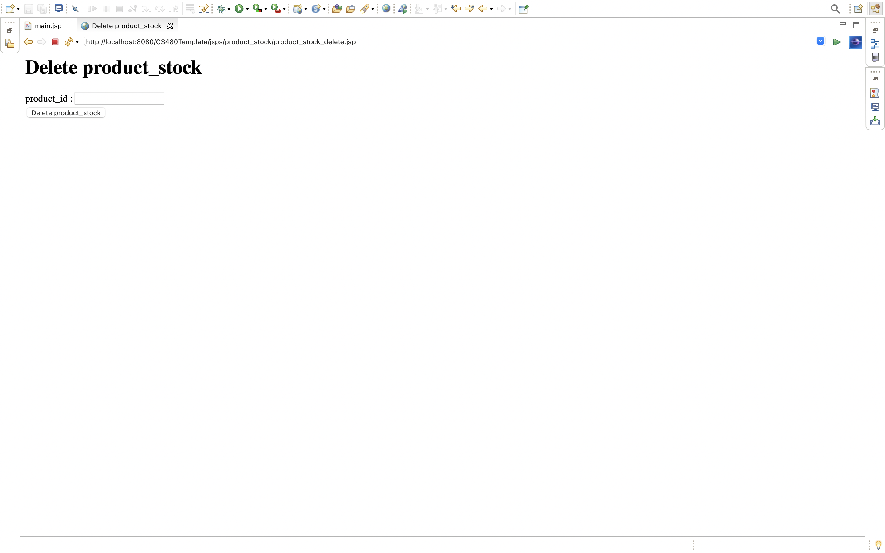

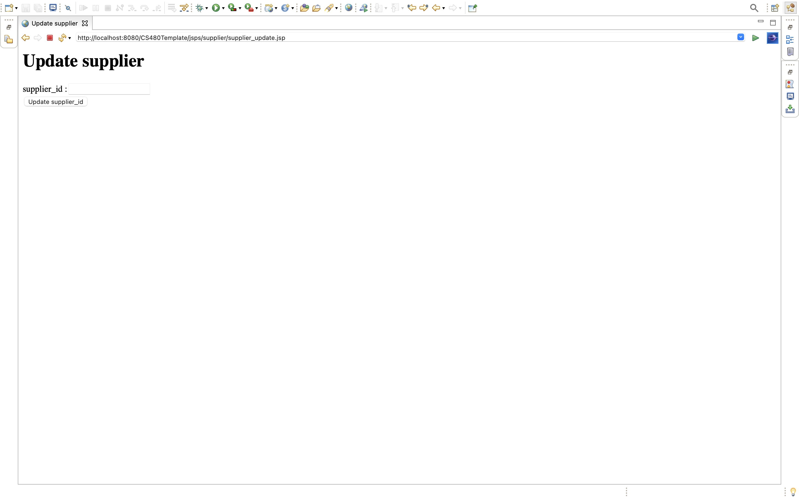
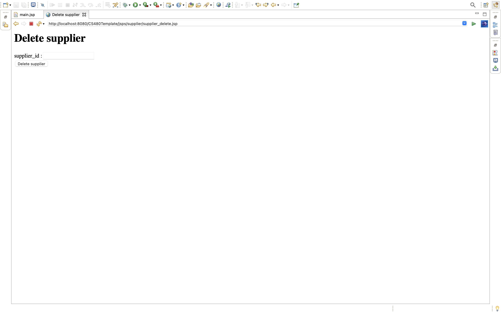
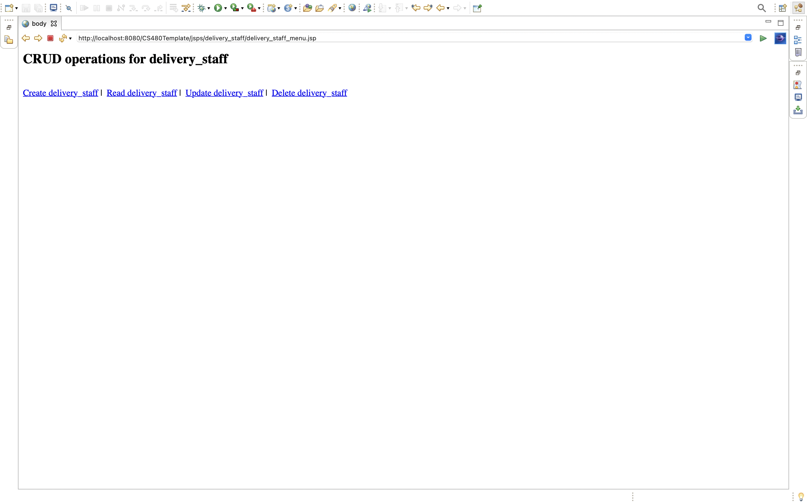

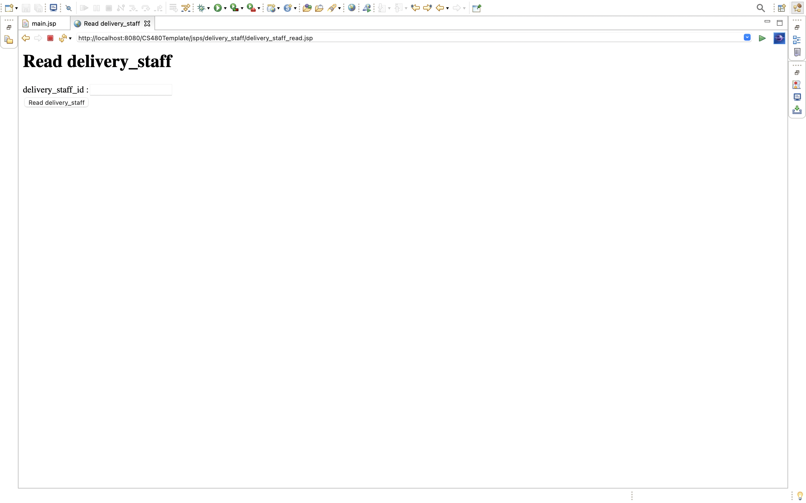

